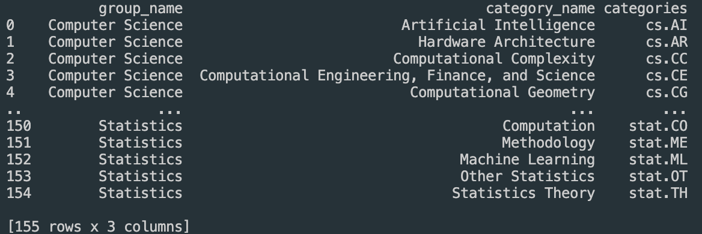
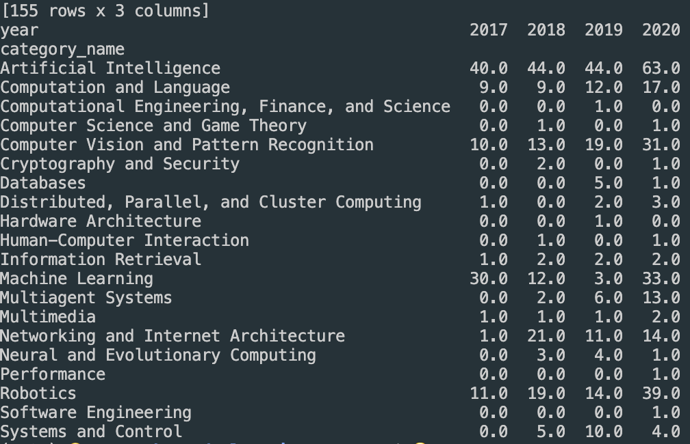
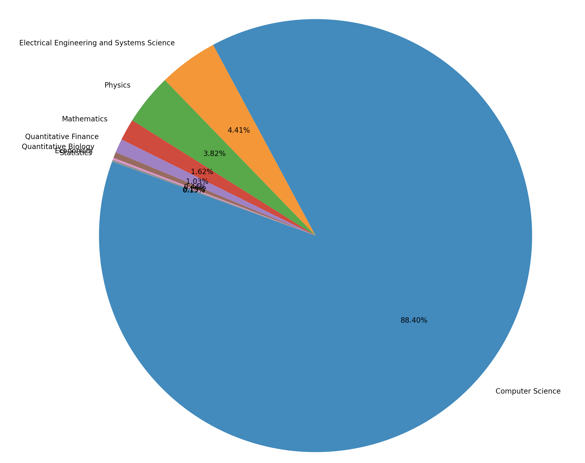
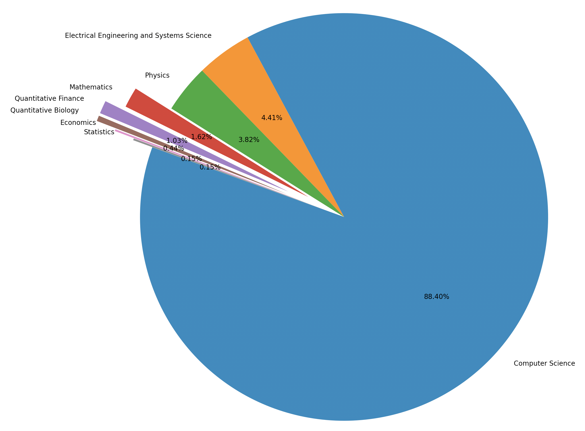

本文参考数据分析组队学习[作业链接](https://github.com/datawhalechina/team-learning-data-mining/blob/master/AcademicTrends/Task1%20%E8%AE%BA%E6%96%87%E6%95%B0%E6%8D%AE%E7%BB%9F%E8%AE%A1.md)，在此基础上做了一个对强化学习领域相关论文的分析，环境使用的是python3.7.9

### 数据集下载

可以直接点击[数据集链接](https://www.kaggle.com/Cornell-University/arxiv?select=arxiv-metadata-oai-snapshot.json)下载所有年份的论文统计数据，压缩包约1G，解压后约3G。

也可以只使用2019年的数据做测试用，执行```wget https://cdn.coggle.club/arxiv-metadata-oai-2019.json.zip```下载即可。

这里由于数据集太大没有放在repo中，可下载解压后放入```task01/data```文件夹中

### 数据集预处理

首先我们只对强化学习相关论文进行分析，而这些论文中的```title```或```abstract```一般会出现Reinforcement Learning的字样，如下(见main.py中的pre_process(data_path)函数)：

```python
temp_dict = json.loads(line)
key_words = ['Reinforcement Learning','reinforcement Learning','Reinforcement learning','reinforcement Learning']
for key_word in key_words:
    if key_word in temp_dict['title'] or key_word in temp_dict['abstract']:
        data.append(json.loads(line))
        break
```

这里考虑首字母大小写定义了四个可能的关键字，选择了```A in B```的字符串查找方法加快速度，参考[三种查找字符串方法的速度比较](https://blog.csdn.net/JohnJim0/article/details/112526662)

然后由于只对年份，数量进行相关分析，所以这里直接删除了一些无关的特征，比如'submitter','authors'等，如下：

```python
del_cols = ['submitter','authors','comments','journal-ref','doi','report-no','license','versions','authors_parsed','title','abstract']
df = df.drop(columns=del_cols) # 删除无关特征
```

并且对时间特征做一个预处理:

```python
df["year"] = pd.to_datetime(df["update_date"]).dt.year #将update_date从例如2019-02-20的str变为datetime格式，并提取处year
del df["update_date"] #删除 update_date特征，其使命已完成
```

然后保存为csv即可，这样处理后的数据就不到1MB了，后面处理起来会很快。

### 获取计算机领域内所有类别

跟[作业链接](https://github.com/datawhalechina/team-learning-data-mining/blob/master/AcademicTrends/Task1%20%E8%AE%BA%E6%96%87%E6%95%B0%E6%8D%AE%E7%BB%9F%E8%AE%A1.md)一样，需要获取计算机领域内所有的类别，不过这里为了简化，只使用了'group_name'，'category_name'和'categories'三个特征，具体见```get_taxonomy()```函数，结果如下：



注意这部分可能出现以下问题：

```bash
bs4.FeatureNotFound: Couldn't find a tree builder with the features you requested: lxml. Do you need to install a parser library?
```

解决办法是```pip install lxml```

### 打印不同类别论文数目随年份的变化

见```plot_year_dist(df,df_taxonomy)```函数，跟[作业链接](https://github.com/datawhalechina/team-learning-data-mining/blob/master/AcademicTrends/Task1%20%E8%AE%BA%E6%96%87%E6%95%B0%E6%8D%AE%E7%BB%9F%E8%AE%A1.md)类似，不过需要注意合并的时候会产生NaN的元素，需要替换为0值：

```python
cats = cats.fillna(0) # 将dataframe中的所有NaN替换为0
```



这里只有2017后的统计，是因为在程序中只保留了2017后的数据，如下：

```python
 ### 保留2017年后的数据 ###
    df = df[df["year"] >= 2017] #找出 year 中2017年以后的数据，并将其他数据删除
    df.reset_index(drop=True, inplace=True) #重新编号
```

### 画出所有类别的数量分布饼图

这部分跟[作业链接](https://github.com/datawhalechina/team-learning-data-mining/blob/master/AcademicTrends/Task1%20%E8%AE%BA%E6%96%87%E6%95%B0%E6%8D%AE%E7%BB%9F%E8%AE%A1.md)是一样的，不过封装成了```plot_cato_dist(df,df_taxonomy)```函数，结果如下：




这里部分显示不清，可参考作业链接使用explode设置局部扇形的半径大小：

```python
explode = (0, 0, 0, 0.2, 0.3, 0.3, 0.2, 0.1) 
plt.pie(_df["id"],  labels=_df["group_name"], autopct='%1.2f%%', startangle=160, explode=explode)
```


