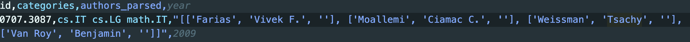
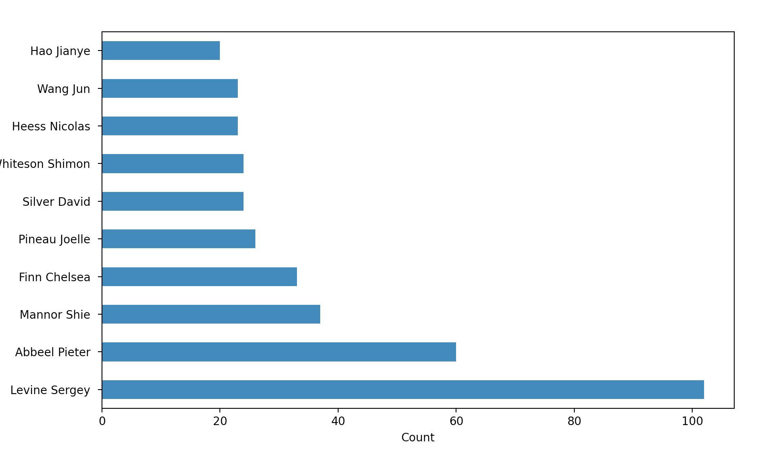

本次延续任务1的思路，继续给强化学习相关论文作者做一个统计，注意不区分一作二作和通信作者，

### 预处理

同样需要先预处理，这次需要作者相关的信息，选择了```authors_parsed```这个特征，如下

```python
for key_word in key_words:
                if key_word in tmp_dict['title'] or key_word in tmp_dict['abstract']:
                    ### 合并作者姓名 ###
                    tmp_dict = {'id':tmp_dict['id'],'categories': tmp_dict['categories'],'update_date':tmp_dict["update_date"], 'authors_parsed': tmp_dict['authors_parsed']}
                    data.append(tmp_dict)         
                    break
```

最后生成csv，内容如下：

### 作者统计

接着统计top10的作者数目，由于读取csv会将```authors_parsed```的内容读取成str类型，所以需要转换成list方便处理，如下：

```python
df['authors_parsed'] = df['authors_parsed'].apply(lambda x: ast.literal_eval(x)) # 读取的str转list
```

最后参考[作业链接](https://github.com/datawhalechina/team-learning-data-mining/blob/master/AcademicTrends/Task2%20%E8%AE%BA%E6%96%87%E4%BD%9C%E8%80%85%E7%BB%9F%E8%AE%A1.md)，就可以画出top10的作者统计了，然后也可以类比统计姓的计数，如下：

