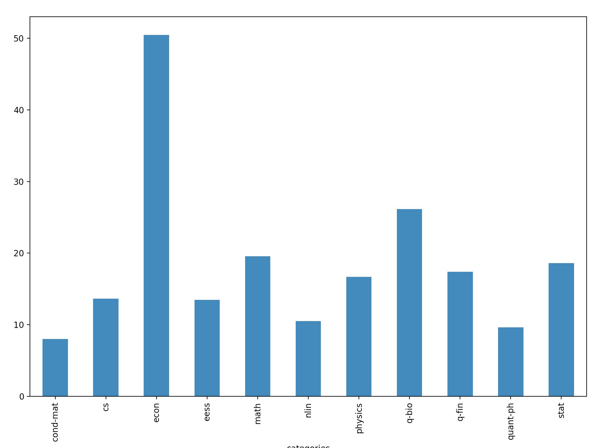
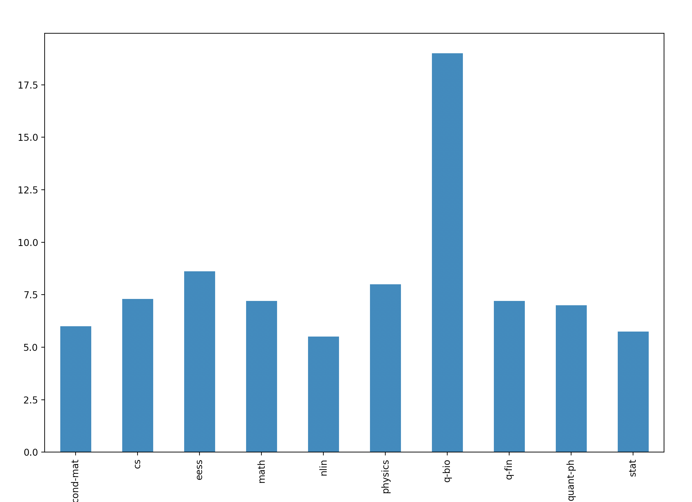
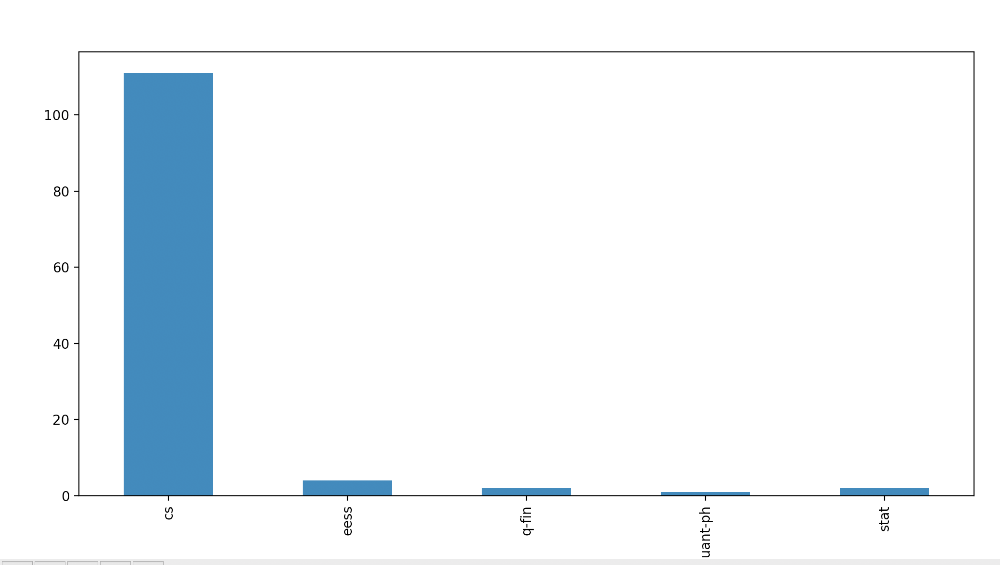

本次作业依然延续之前的思路，参考[作业链接](https://github.com/datawhalechina/team-learning-data-mining/blob/master/AcademicTrends/Task1%20%E8%AE%BA%E6%96%87%E6%95%B0%E6%8D%AE%E7%BB%9F%E8%AE%A1.md)对强化学习领域论文做了一个简单的分析，代码见```main.py```

### 数据集预处理

跟前面类似，不过这次保留的特征不同，包含摘要，分类和备注：

```python
tmp_dict = {'abstract':tmp_dict['abstract'],'categories': tmp_dict['categories'],'comments':tmp_dict['comments']}
```

### 统计论文的页数

结果如下：



可见，普遍都在10-20页之间

### 统计图表个数

结果如下：



一般都是7个图表左右

### 统计包含代码的论文个数

结果如下：



结合task01中统计的论文总数4000+，可见开源代码的论文并不多。