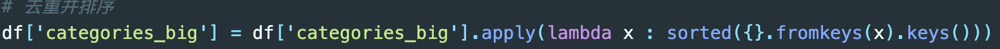
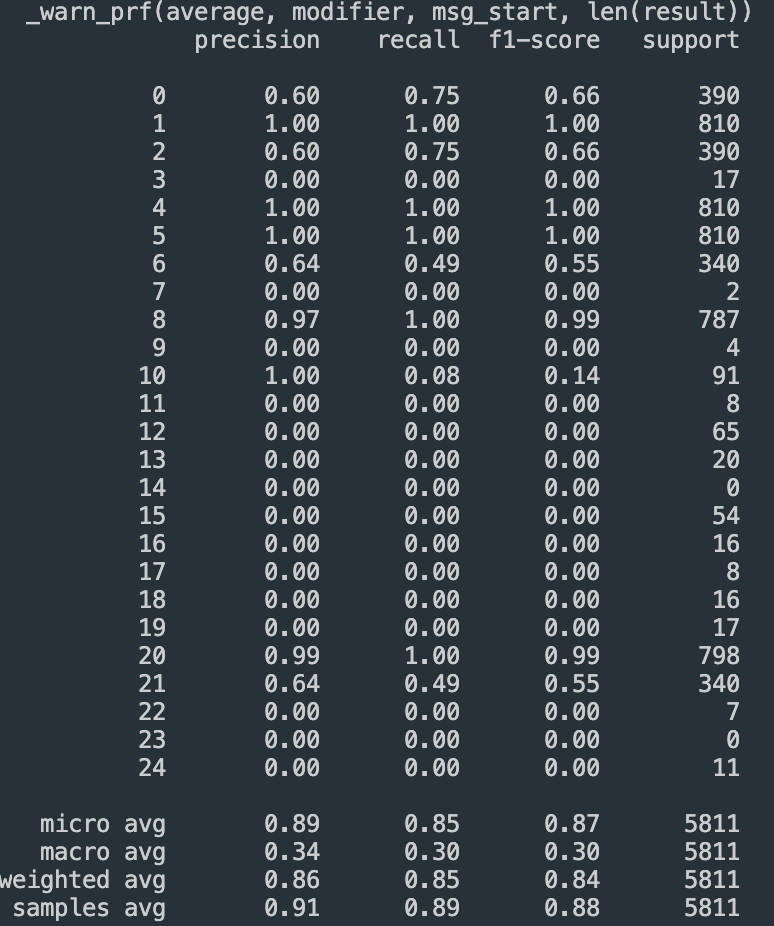
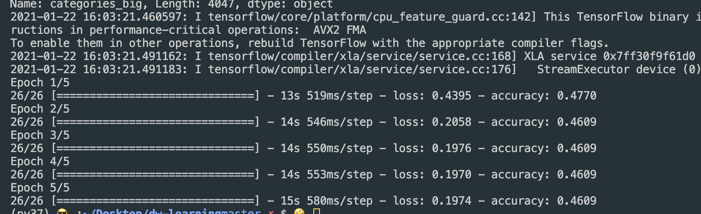

延续之前思路并参考作业链接做了强化学习论文的文本分类。

在预处理方面，增加了大类的去重和排序

以下分别是思路1和思路2的结果，效果并不是很好，之后有时间实现思路3和思路4

思路1: 直接使用TF-IDF对文本提取特征，使用分类器进行分类，分类器的选择上可以使用SVM、LR、XGboost等

思路2: FastText是入门款的词向量，利用Facebook提供的FastText工具，可以快速构建分类器

