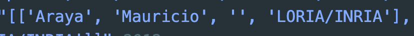
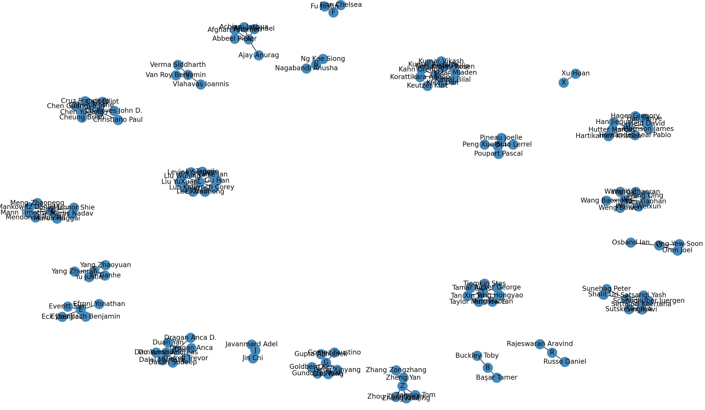
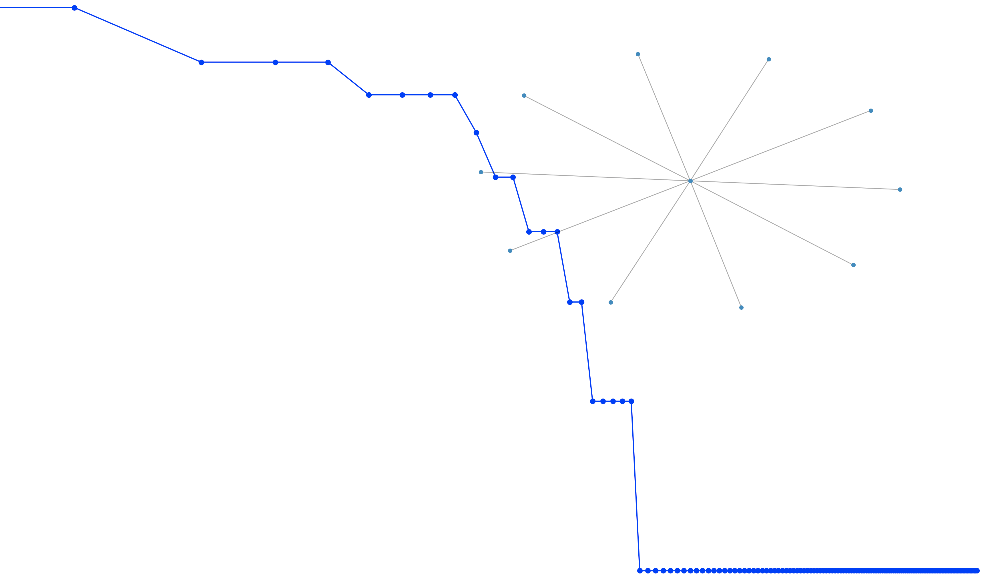

参考[作业链接](https://github.com/datawhalechina/team-learning-data-mining/blob/master/AcademicTrends/Task5%20%E4%BD%9C%E8%80%85%E4%BF%A1%E6%81%AF%E5%85%B3%E8%81%94.md)对强化学习领域论文做了相关分析，目前发现了几个问题，

### 问题1

首先在特征中会出现不规则的格式，如下



即后面可能附加地区等字样，因此只取前三样姓名的部分：

```python
def util_name_apply(authors):
    new_authors = []
    for author in authors:
        new_authors.append(author[:3]) # 由于可能出现如['Araya', 'Mauricio', '', 'LORIA/INRIA']中这种'LORIA/INRIA'类似于地区或者其他的无效字眼，所以需要筛除去前三项包含姓名的
    return new_authors
```

### 问题2

论文数量太多，导致建图缓慢，因此只取各论文的前三作以及只选取包含频数top10的论文，

```python
def method1(df):
    df['authors_parsed'] = df['authors_parsed'].apply(lambda x: ast.literal_eval(x)[:3]) # 读取的str转list
    all_authors = sum(df['authors_parsed'], [])
    # 拼接所有的作者
    authors_names = [' '.join(x[:-1]) for x in all_authors]
    authors_names = pd.DataFrame(authors_names)
    top10_names= authors_names[0].value_counts().index.values[:10].tolist()
    print(top10_names)
    G = nx.Graph()
    n = 0
    for i in range(len(df)):
        authors = df.iloc[i]['authors_parsed']
        authors = [' '.join(x[:-1]) for x in authors]
        # print(authors)
        if list(set(authors)&set(top10_names)):
            n+=1
            for author in authors[1:]:
                G.add_edge(author[0],author)
    print(n)
    # 计算论文关系中有多少个联通子图
    print(len(nx.communicability(G)))
    nx.draw(G, with_labels=True)

    degree_sequence = sorted([d for n, d in G.degree()], reverse=True)
    dmax = max(degree_sequence)
    plt.loglog(degree_sequence, "b-", marker="o")
    plt.title("Degree rank plot")
    plt.ylabel("degree")
    plt.xlabel("rank")
    # draw graph in inset
    plt.axes([0.45, 0.45, 0.45, 0.45])
    Gcc = G.subgraph(sorted(nx.connected_components(G), key=len, reverse=True)[0])

    pos = nx.spring_layout(Gcc)
    plt.axis("off")
    nx.draw_networkx_nodes(Gcc, pos, node_size=20)
    nx.draw_networkx_edges(Gcc, pos, alpha=0.4)
    plt.show()
```

结果如下：



